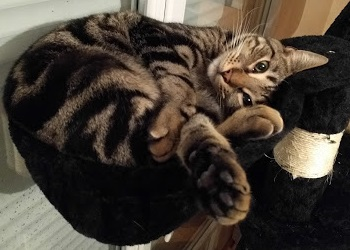

# Leo Adventure Cat

Jouez tout en aidant la cause animale !

Lâchement abandonné par son maître, aidez Léo à retrouver son frère à travers de nombreuses aventures. 

**La recette générée par ce jeu est reversée à une association animale** ([plus d'infos](#cause-animale)).

## Téléchargement
*[Jeu pas encore disponible]*

## Développement
Lors du développement du jeu, mon objectif était de ne pas importer de ressources externes et d'essayer de tout créer moi-même, pour savoir si j'allais être capable de produire tous les éléments nécessaires à son développement.
Malgré mes lacunes artistiques, j'ai donc dessiné et développé seul l'intégralité du jeu, sans avoir à rechercher des personnages ou décors existants sur internet.

Ainsi, l'idée était d'améliorer ma compétence graphique (proche du néant) pour que celle-ci soit ma seule limite (ainsi que mon imagination) dans la conception de ce jeu vidéo (*et des suivants ?*).
Je suis agréablement surpris du résultat, désormais, je ne dépends plus des ressources (gratuites ou payantes) obtenues sur internet.
Quoi de plus frustrant que d'avoir une idée géniale de personnage ou de décor et de ne pas pouvoir l'implémenter, faute de trouver les images nécessaires à sa réalisation ?

Côté programmation, pas de problème particulier étant déjà auto-suffisant *(je n'allais quand même pas partir avec que des désavantages...)*.

### Making of
*[À venir]*

## Cause animale
### Comment sont utilisés vos dons ?
Les dons et bénéfices générés par la publicité seront utilisés pour acheter des croquettes pour chat qui seront offertes à l'[Association pour la Protection les Chats Libres d'Orléans](http://www.apclo.fr/) (APCLO). 
L'association recueille, soigne, identifie et stérilise les chats errants afin de les rendre libres ou disponibles à l'adoption.

L'association agit principalement grâce aux dons. C'est pourquoi j'ai décidé de monétiser ce jeu afin d'aider l'APCLO, grâce à qui je vis désormais avec Léo : 



La recette générée par la publicité ne peut être récupérée qu'à partir de $100USD. Ce cap sera donc considéré comme une victoire s'il est atteint, car il permettrait l'achat d'une vingtaine de kg de croquettes.
Par la suite, si le jeu est toujours un succès et si le public (vous !) en fait sentir la demande, une partie de la recette pourrait être utilisée pour continuer à développer le jeu (améliorations, niveaux supplémentaires, suite ?).

### Comment participer ?
Si vous souhaitez participer financièrement, il est possible de faire un don ou bien de réaliser un achat dans le jeu.

Autrement, vous pouvez participer simplement en regardant une publicité à travers le jeu, en diffusant le jeu à vos amis ou en partageant notre esprit collaboratif. Chaque petit geste compte :)

### Avancement des dons et recettes publicitaires :
*[Jeu pas encore disponible]*

* **Total publicité : 0€** (la recette publicitaire ne peut être récupérée qu'à partir de $100 USD selon [les conditions de UnityAds](https://unityads.unity3d.com/help/faq/monetization#how-does-the-payment-process-work-))
* **Total dons : 0€**

*Dernière mise à jour : 11/09/2017*

### Actions déjà réalisées grâce aux dons et bénéfices :
*[Jeu pas encore disponible]*


## Memo

### Planning prévisionnel
* 03/09 : prototype chat (animé, maintenable)
* 10/09 :  level prototype
			+ level creating method
			+ level background parallax
			+ UI command
			+ Android prototype
* 17/09 :  Create real project
			+ Game Menu
* 24/09 :  Dessiner tous les levels

### Remember
**Use adb logcat :**
Launch Command Prompt at adb.exe location (*C:\Users\[username]\AppData\Local\Android\android-sdk\platform-tools*) then type : 
```
adb logcat -s Unity ActivityManager PackageManager dalvikvm DEBUG
```

**Get device ID or AdMob :**
See [doc](https://developers.google.com/admob/android/test-ads)
Launch Command Prompt at adb.exe location (*C:\Users\[username]\AppData\Local\Android\android-sdk\platform-tools*) then type : 
```
adb shell
settings get secure android_id
```


**Tiled2Unity : Sorting Layer**
* [How to auto import Sorting Layer](http://www.seanba.com/megadadadventures.html)
* Create a string custom property named `sortingLayerName` on the Tiled layer, and set it with the name of the Unity sorting layer.
* For the collision layer, clic on the rectangle collider in the Tile Collision Editor and the `Type` property to match the physics layer in Unity.

### Graphismes
* **Bonus/Icônes :** Filtres > Distorsion de lentille
* Sprites : Contour avec crayon taille 2, puis selection, réduire de 1, inverser la sélection, adoucir de 2, supprimer

## Resources
* [How to animate a cat walking cycle](https://www.youtube.com/watch?v=dYCGMdQgs-I)
* [The Secret to Creating Perfect Color Palettes](https://gamedevelopment.tutsplus.com/articles/picking-a-color-palette-for-your-games-artwork--gamedev-1174) :
> **Hue** defines the tone of the actual color. For example, the color red has a hue value of 0 regardless of what you set the saturation and brightness values to. If you change that hue value to 120 you will have changed the color to green and if you change it to 240 the color will become blue.
> 
> Now what happens if we take one of those colors and give it a **saturation** value of 50? It looks as if you are picking a different color, but you are actually only affecting the intensity of the color - that is, how vivid the color is. Reducing the saturation makes the color look washed out.
> 
> **Brightness**, then, accounts for how light or dark the color is. If we reduced the brightness of a color, we would see this as a darker shade of that same color.
> 
> To create a great color palette you need only follow this rule:
> 
>     IF hues do not equal each other
>     THEN set saturations to match each other
>     AND set brightnesses to match each other
>     
>     ELSE IF saturations do not equal each other
>     THEN set hues to match each other
>     AND set brightnesses to match each other
>     
>     ELSE IF brightnesses do not equal each other
>     THEN set hues to equal each other
>     AND set saturations to equal each other
* [Free Country Flags](https://www.countryflags.com/en/)

## Author
[Bryan MARTINET](https://maarti.net)

## Credits
* Icons made by Smashicons from flaticon.com
* Font made by Vanessa Bays